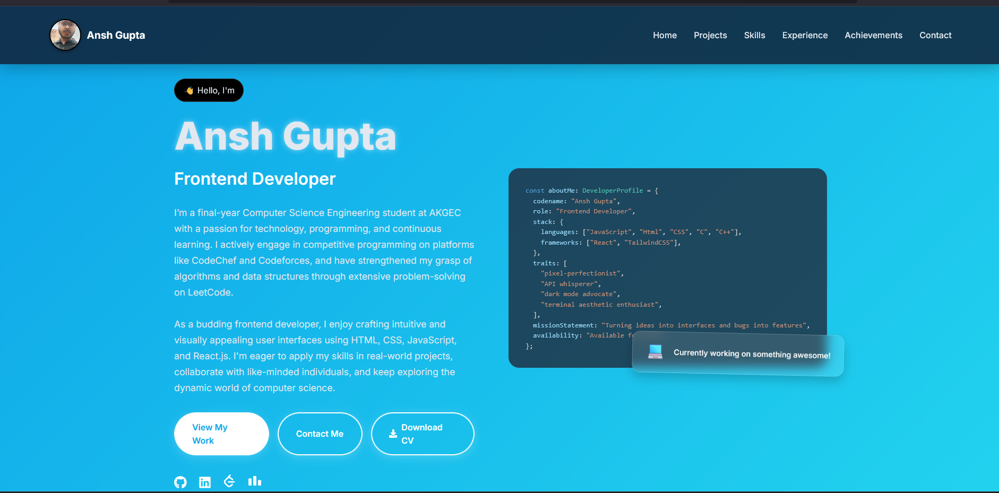

# 🚀 Ansh Gupta's Developer Portfolio

Welcome to my personal portfolio website, built using **React**, **Framer Motion**, and modern UI design principles. This project showcases my development skills, experience, achievements, and contact information — all in a single-page, responsive web app.

## 🌐 Live Demo

👉 [View Portfolio on Vercel](https://my-portfolio-beta-sandy-61.vercel.app/)

---

## 📸 Preview



---

## 🛠️ Tech Stack

- ⚛️ React
- 🎨 CSS
- 💫 Framer Motion (animations)
- 📩 EmailJS (optional contact integration)
- 🌐 Deployed via Vercel

---

## ✨ Features

- Responsive design for mobile, tablet, and desktop
- Animated sections using Framer Motion
- Smooth scroll navigation
- Sections:
  - Hero / About Me
  - Projects
  - Skills
  - Experience
  - Achievements
  - Contact
- Highlighted coding profiles (LeetCode, Codeforces, CodeChef)

---

## 🧑‍💻 Installation & Running Locally

```bash
# 1. Clone the repository
git clone https://github.com/your-username/your-repo-name.git

# 2. Navigate to the project directory
cd your-repo-name

# 3. Install dependencies
npm install

# 4. Run the app
npm run dev
